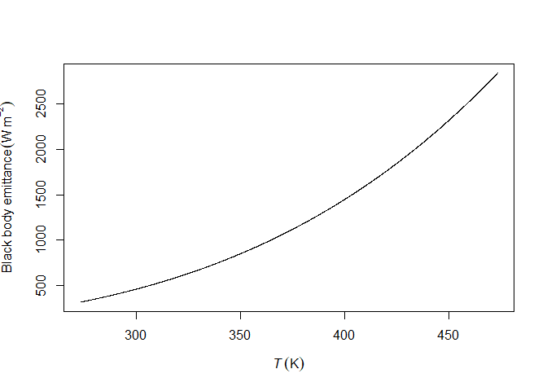

Agmet is a collection of functions to calculate solar position,
reference evapotranspiration, and soil water balance.

The following document describes the procedures to install Agmet
directly from GitHub as well as some of the functionalities embedded in
this package.

## Package’s installation

To install Agmet in your computer with R already installed do the
following

``` r
install.packages('devtools')
```

    ## Installing package into 'C:/Users/jvito/AppData/Local/Temp/Rtmp4WZ6m8/temp_libpath24147c061a1d'
    ## (as 'lib' is unspecified)

    ## package 'devtools' successfully unpacked and MD5 sums checked
    ## 
    ## The downloaded binary packages are in
    ##  C:\Users\jvito\AppData\Local\Temp\RtmpG0s9Wi\downloaded_packages

``` r
devtools::install_github('https://github.com/jvitorpinto/agmet.git')
```

    ## Downloading GitHub repo jvitorpinto/agmet@HEAD

    ## cpp11      (0.4.6 -> 0.5.2) [CRAN]
    ## timechange (0.2.0 -> 0.3.0) [CRAN]
    ## lubridate  (1.9.3 -> 1.9.4) [CRAN]

    ## Installing 3 packages: cpp11, timechange, lubridate

    ## Installing packages into 'C:/Users/jvito/AppData/Local/Temp/Rtmp4WZ6m8/temp_libpath24147c061a1d'
    ## (as 'lib' is unspecified)

    ## package 'cpp11' successfully unpacked and MD5 sums checked
    ## package 'timechange' successfully unpacked and MD5 sums checked
    ## package 'lubridate' successfully unpacked and MD5 sums checked
    ## 
    ## The downloaded binary packages are in
    ##  C:\Users\jvito\AppData\Local\Temp\RtmpG0s9Wi\downloaded_packages
    ## ── R CMD build ─────────────────────────────────────────────────────────────────
    ##          checking for file 'C:\Users\jvito\AppData\Local\Temp\RtmpG0s9Wi\remotes2b185112e4\jvitorpinto-agmet-48fb206/DESCRIPTION' ...     checking for file 'C:\Users\jvito\AppData\Local\Temp\RtmpG0s9Wi\remotes2b185112e4\jvitorpinto-agmet-48fb206/DESCRIPTION' ...   ✔  checking for file 'C:\Users\jvito\AppData\Local\Temp\RtmpG0s9Wi\remotes2b185112e4\jvitorpinto-agmet-48fb206/DESCRIPTION'
    ##       ─  preparing 'agmet': (827ms)
    ##    checking DESCRIPTION meta-information ...  ✔  checking DESCRIPTION meta-information
    ##       ─  checking for LF line-endings in source and make files and shell scripts
    ##       ─  checking for empty or unneeded directories
    ##      NB: this package now depends on R (>=        NB: this package now depends on R (>= 3.5.0)
    ##        WARNING: Added dependency on R >= 3.5.0 because serialized objects in
    ##      serialize/load version 3 cannot be read in older versions of R.
    ##      File(s) containing such objects:
    ##        'agmet/data/belem_weather.RData'
    ##   ─  building 'agmet_0.1.1.tar.gz'
    ##      
    ## 

    ## Installing package into 'C:/Users/jvito/AppData/Local/Temp/Rtmp4WZ6m8/temp_libpath24147c061a1d'
    ## (as 'lib' is unspecified)

## Using Agmet

The function `stefan_boltzmann_law` calculates the amount of radiation
emitted by a black body as a function of its absolute temperature.

``` r
temp <- seq(273.15, 473.15, by = 0.1)
y <- stefan_boltzmann_law(temp)

plot(temp, y, type = 'l', xlab = expression(italic(T) ~ ('K')), ylab = expression('Black body emittance' ~ (W ~ m^-2)))
```

<!-- -->
